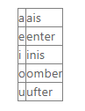
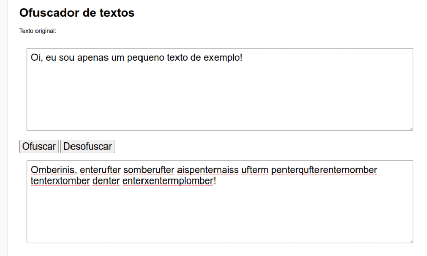

# Atividade 1

Existem momentos em que você quer passar um bilhetinho para um amigo ou amiga, ou ainda um "zap", mas não quer que qualquer um intercepte as suas mensagens. Para não usar um app auxiliar ou uma camada de criptografia extra, você usa um código simples, que altera apenas as vogais do seu texto, mas já o torna bastante ilegível. Você utiliza a tabela a seguir:

​Ao trocar essas letras, acontece isso com o seu texto.

"Oi, eu sou apenas um pequeno texto de exemplo!"

Que se torna:

"Omberinis, enterufter somberufter aispenternaiss ufterm penterqufterenternomber tenterxtomber denter enterxentermplomber!"

O caminho de volta para "desofuscar" o texto é simples, apenas desfazendo o que foi feito.

Seu trabalho é criar, usando HTML, CSS e JavaScript, um Ofuscador/Desofuscador de textos que segue essa tabela, com um campo para o texto original, um campo para o texto modificado. Pode usar o modelo a seguir, mas pode também formatar do seu jeito.

​Dicas:

- Lembre-se de que JavaScript diferencia letras minúsculas e maiúsculas.
- Você pode usar a função .replace() do JavaScript.
- Ao substituir as letras, deixe a letra "A" por último, para não dar problemas quando for substituir o "I".

Compacte os seus arquivos utilizados em um único arquivo .zip para enviar.

Um ótimo trabalho a todos.
