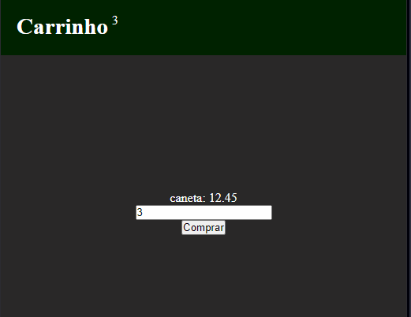

# Carrinho de compras.



```js
const price = 12.45;
document.querySelector('span').innerHTML = `caneta: ${price}`;

const number = [];

function compras() {
  const contador = document.querySelector('#contador');
  const quantidade = document.querySelector('input').value;

  !quantidade ? alert('Informe a quantidade.') : false;

  if (quantidade) {
    number.push(Number(quantidade));
    const response = number.reduce((total, quantidade) => {
      return total + quantidade;
    }, 0);
    contador.innerHTML = `${response}`;
    quantidade.value = '';

    const resultado = response * price;

    console.log(resultado.toFixed(2));
  }
}
```
